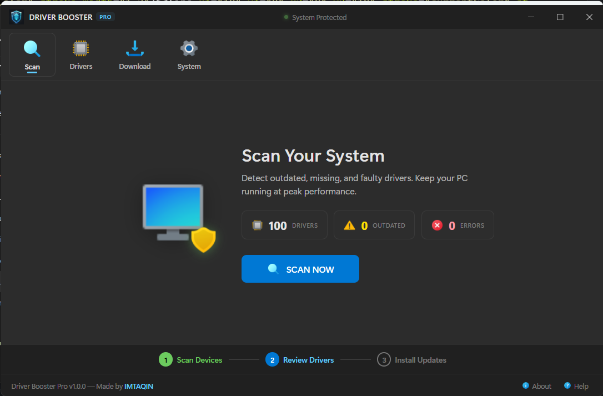
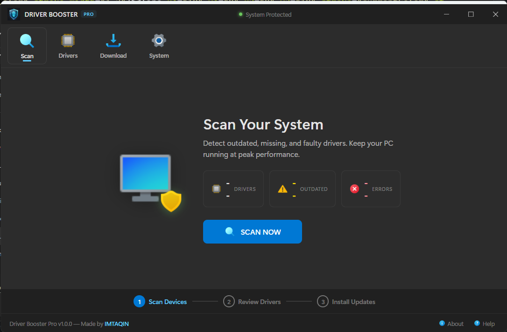
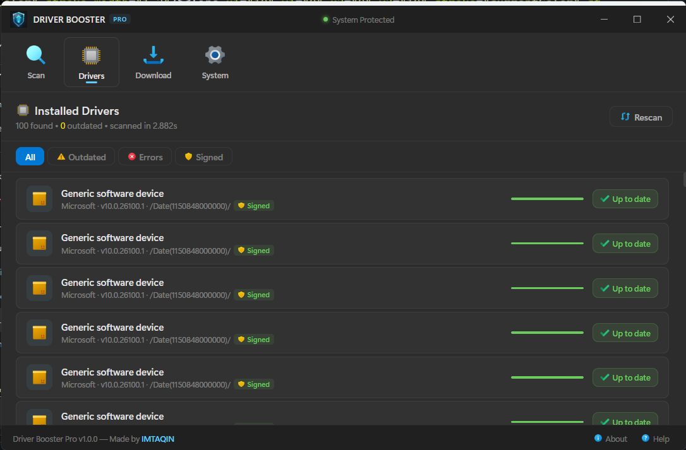
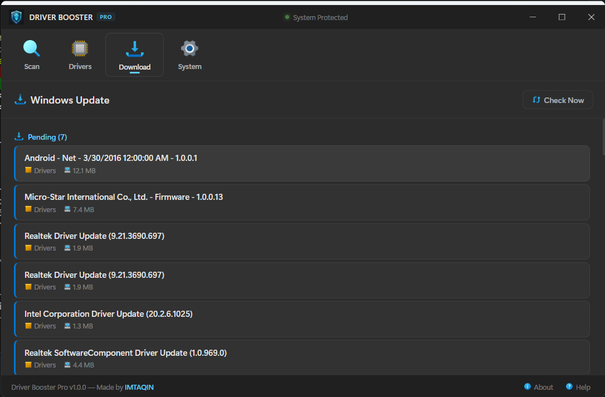
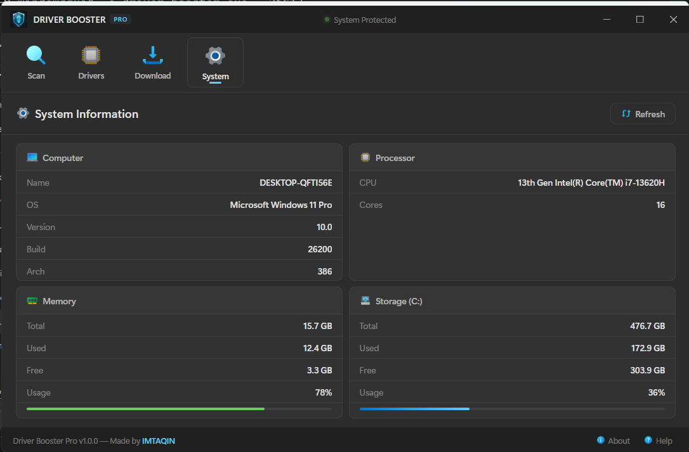
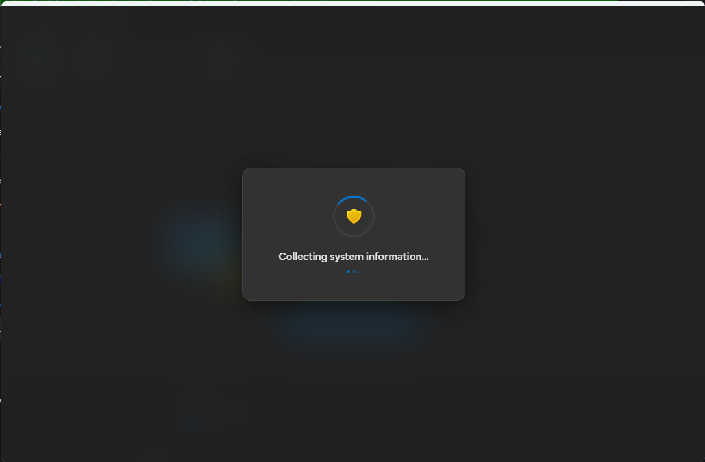

# Driver Booster Pro

Open-source Windows desktop app for scanning drivers, checking Windows updates, and monitoring system health. Built with **Go + WebView2**, single EXE (~10 MB), native Windows 11 dark theme.



## Features

- **Driver Scanner** — Enumerates all PnP signed drivers via WMI, detects outdated drivers
- **Windows Update** — Checks pending updates via Windows Update Agent COM API
- **System Monitor** — Real-time RAM, disk, OS, and CPU info via direct Win32 API syscalls
- **Frameless Window** — Custom title bar with Windows 11-style min/max/close controls
- **No CMD Flash** — All subprocess calls use `CREATE_NO_WINDOW` flag
- **Single EXE** — All HTML/CSS/JS/icons embedded via Go `embed` directive

## Screenshots

| Scan | After Scan |
|------|-----------|
|  |  |

| Driver List | Windows Update |
|-------------|---------------|
|  |  |

| System Info | Loading |
|-------------|---------|
|  |  |

## Tech Stack

| | |
|---|---|
| **Language** | Go 1.26 |
| **UI Framework** | WebView2 ([jchv/go-webview2](https://github.com/jchv/go-webview2)) |
| **Frontend** | HTML + CSS + Vanilla JS (embedded) |
| **Windows API** | kernel32.dll, ntdll.dll, user32.dll (via syscall) |
| **Design** | Windows 11 WinUI3 Mica dark theme |
| **Icons** | 27 Fluency-style PNG assets |

## Build

Requires Go 1.21+ and Windows 10/11 with WebView2 runtime (preinstalled on most systems).

```bash
git clone https://github.com/imtaqin/driver-booster-pro.git
cd driver-booster-pro
go mod download
go build -ldflags "-H windowsgui" -o driver-booster.exe .
```

## Project Structure

```
driver-booster/
├── main.go                     # WebView2 window + frameless controls
├── internal/
│   ├── cmdutil/cmdutil.go      # Hidden subprocess helper
│   ├── sysinfo/sysinfo.go      # Win32 API system info
│   ├── drivers/drivers.go      # PnP driver enumeration
│   ├── winupdate/winupdate.go  # Windows Update Agent
│   └── bridge/bridge.go        # HTTP API bridge
├── ui/
│   ├── index.html              # SPA with 4 tabs
│   ├── style.css               # Win11 WinUI3 dark theme
│   ├── app.js                  # Frontend logic
│   └── icon-*.png              # 27 fluency-style icons
├── winres/                     # go-winres config + icons
├── resources/                  # App icon + manifest
└── screenshot/                 # App screenshots
```

## Windows API Usage

- `kernel32.dll` — `GlobalMemoryStatusEx`, `GetDiskFreeSpaceExA`, `GetComputerNameW`
- `ntdll.dll` — `RtlGetVersion` (accurate OS version, bypasses compatibility shims)
- `user32.dll` — `SetWindowLong`, `ReleaseCapture`, `SendMessage` (frameless window + drag)
- **WMI** — `Win32_PnPSignedDriver` for driver enumeration
- **COM** — `Microsoft.Update.Session` for Windows Update

## Technical Write-up

Detailed tutorial covering frameless windows, hiding PowerShell console flashes, and Win32 integration:

https://imtaqin.id/building-windows-11-desktop-app-go-webview2

## License

Open source. Free to fork, extend, and use.

## Credits

Made by [**IMTAQIN**](https://imtaqin.id)
